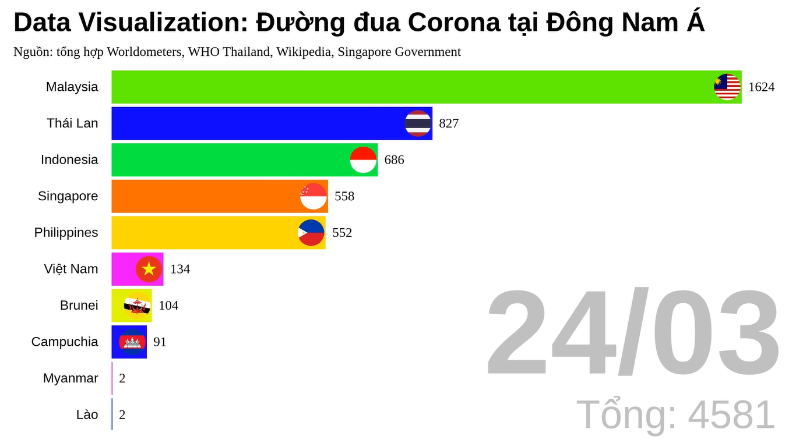

# bar-chart-race
An implementation of bar chart race in JavaScript

[Demo Video](https://www.youtube.com/watch?v=ckO_9_MCfE4)

## Preprocess Data
1. Put `data.xlsx` in `data/` directory. 
2. Modify the code in `preprocess_data.py` to read `data.xlsx` and convert the data to `data.json` and `data.js`.

## Preprocess Icons
1. Put all the icons inside `raw_icons/` directory. 
2. Run `preprocess_icons.py` to convert all icons to `.png` format. All formatted icons will be generated into `icons/` folder.

## Run
Open `index.html` in browser. Click stateButtons to run/stop/reset the animation.

## Record
1. Use OBS Studio in Ubuntu enviroment as screen recorder.
2. In OBS Studio, choose source as browser, set the local file to `index.html`. Change the resolution to fit the graph. Default is (1920x1080). The FPS should be 30, higher than that should require a more powerful machine or there will occur  frame dropping while recording.
3. Start Recording. The output video should be in `.mkv` format by default.

## Convert `.mkv` to `.mp4`
Adobe Premiere Pro doesn't support `.mkv`, so you need to convert the video to `.mp4` first. Ex: use FormatFactory,...

## Edit Video
1. Use Premiere Pro to edit the video. This project includes `final.proproj`, please open it with CC version 2019 or higher.
2. Export media with .h264 codec and medium bitrate.

## Upload Video
Small tip: You should choose the thumbnail as the last frame so it will be more attractive to the viewer.

## Future Features
- The changing rate of bars' width, bars' position should be a log function or sigmoid function.
- The bar that are rising should be larger than other bars while swapping.
- The color for each bar should be unique. Random color selecting still result in indistinguishability if there are many bars.